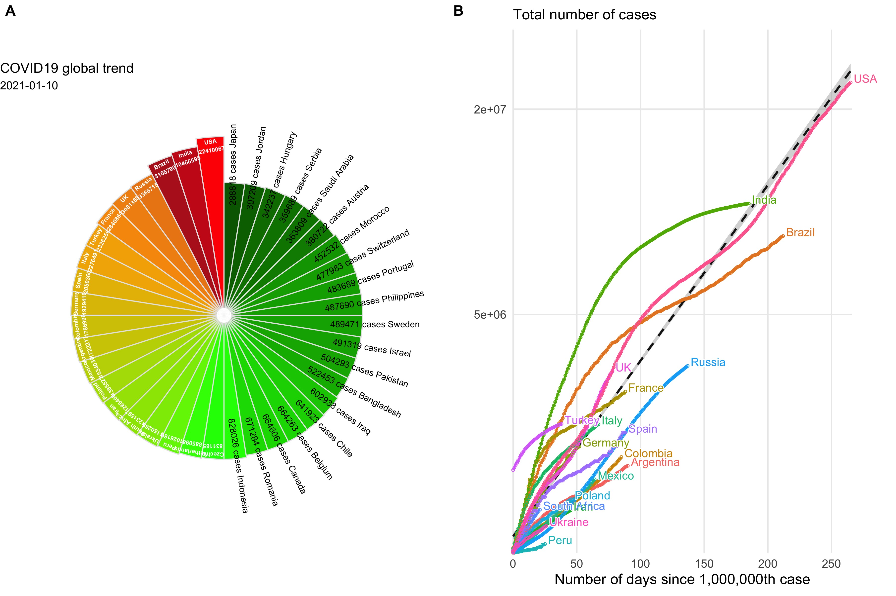

# nCov2019: An R package for exploring COVID-19 statistics

The package was developed since Jan. 2020 and originally hosted on [GuangchuangYu/nCov2019](https://github.com/GuangchuangYu/nCov2019). This repo contains an up-to-date version with data from new sources (from worldometers and JHUCSSE) and new data types (vaccine and therapeutics data).


## :house: Data Sources

+ Latest data  of coronavirus cases: [worldometers](https://www.worldometers.info/coronavirus/)
+ Historical data of coronavirus cases : [JHUCSSE](https://coronavirus.jhu.edu/map.html)
+ Vaccine data: [raps.org](https://www.raps.org/news-and-articles/news-articles/2020/3/covid-19-vaccine-tracker)
+ Therapeutics data:  [raps.org](https://www.raps.org/news-and-articles/news-articles/2020/3/covid-19-therapeutics-tracker)

Fetching data using API provided by [disease.sh](https://disease.sh)


**Find out more on the vignette [vignette](https://yulab-smu.top/nCov2019/).**


## :writing\_hand: Authors

Guangchuang YU and Tianzhi Wu

[](https://yulab-smu.top/images/biobabble.jpg)

<https://yulab-smu.top>


If you use `nCov2019`, please cite the following preprint:

Tianzhi Wu, Erqiang Hu, Xijin Ge<sup>\*</sup>, Guangchuang Yu<sup>\*</sup>. [Open-source analytics tools for studying the COVID-19 coronavirus outbreak](https://www.medrxiv.org/content/10.1101/2020.02.25.20027433v2). **medRxiv**, 2020.02.25.20027433. doi: <https://doi.org/10.1101/2020.02.25.20027433> 


## :arrow\_double\_down: Installation

Get the development version from github:

``` r
## install.packages("remotes")
remotes::install_github("YuLab-SMU/nCov2019")
```

## :beginner: Usages

+  `res <- query()` to query 5 types of statistics
    + global summary, 
    + latest data
    + historical data
    + vaccine data
    + therapeutic data
+  `x <- res$global` to access  global summary data
    + `summary(x)` will return global  overview
    + `x$affectedCountries` will return total affected countries,(other 20 types of statistics is available)
+  `y <- res$latest`  or `y <- res$historical` to access  `latest` or `historical` data
    + `y["global"]` will return all countries' statistics 
    + `y[country]` will return country level statistics
    + For countries in  `China`, `UK`, `Australia`,  `Canada` ,`Denmark` ,  `France`  and  `Netherlands`, provincial data is also available and `y[country,province]` will return statistics data of the selected province
+ `z <- res$vaccine`  or `y <- res$therapeutics` to access  `vaccine` or `therapeutic` data
    + `summary(z)`  will return the summary of  their trial phase
    + `z["all"]` will return all candidate 
    + `z[ID="id1"]` each vaccine or therapeutics candidate has an id, this will return detail description of the selected candidate (*e.g.*, "id1")
+ `plot()` to present data on map
+ `dashboard()` to open Shiny app dashboard

## :art: Example

Run the script [example.R](example.R) in R using `source("example.R")`, will produce the following figure:



## :book: Documents

+ [online vignette](https://yulab-smu.top/nCov2019/)
+ [An R Package to Explore the Novel Coronavirus](https://towardsdatascience.com/an-r-package-to-explore-the-novel-coronavirus-590055738ad6)


## :chart\_with\_upwards\_trend: Shiny Apps that use `nCov2019`

+ [Coronavirus Tracking dashboard](https://coronavirus.john-coene.com/)
+ [Novel Coronavirus Pneumonia (NCP-2019) Dashboard](https://github.com/gaospecial/NCPdashboard)
+ [Coronavirus COVID-19 outbreak statistics and forecast](http://www.bcloud.org/e/)


## :sparkling\_heart: Collected in resource list

+ [Open-Source-COVID-19](https://weileizeng.github.io/Open-Source-COVID-19/)
+ [Top 7 R resources on COVID-19 Coronavirus](https://www.statsandr.com/blog/top-r-resources-on-covid-19-coronavirus/)
+ [COVID-19 Coronavirus Disease resources](http://covirusd.com/resources/)
