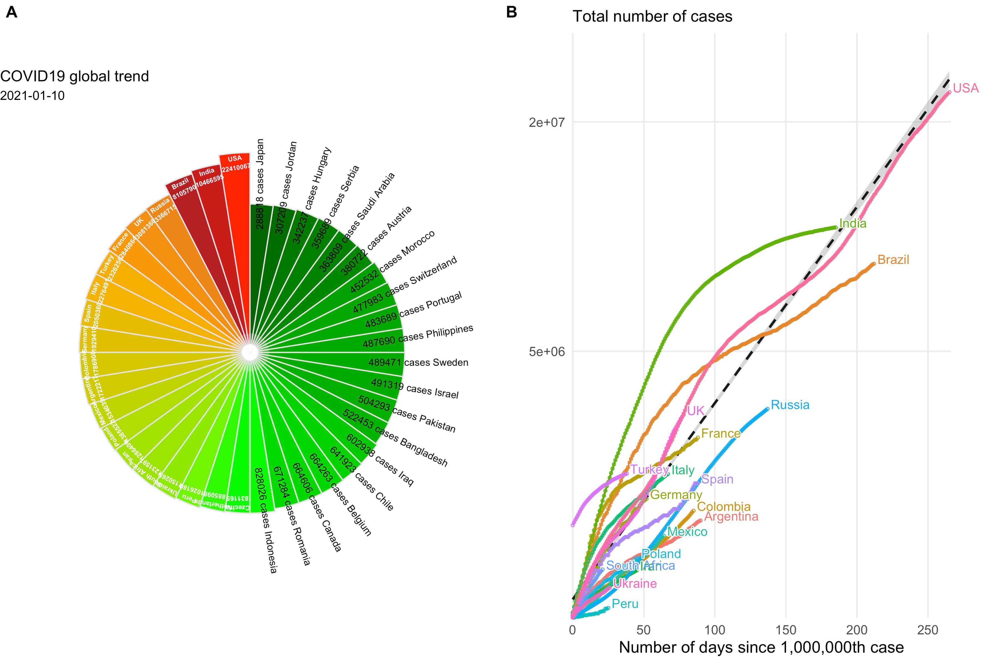

# nCov2019: An R package for exploring COVID-19 statistics

## :house: Data Sources

Latest data  of coronavirus cases: [worldometers](https://www.worldometers.info/coronavirus/)

Historical data of coronavirus cases : [JHUCSSE](https://coronavirus.jhu.edu/map.html)

Vaccine data: [raps.org](https://www.raps.org/news-and-articles/news-articles/2020/3/covid-19-vaccine-tracker)

Therapeutics data:  [raps.org](https://www.raps.org/news-and-articles/news-articles/2020/3/covid-19-therapeutics-tracker)

Fetching data using API provided by [disease.sh](https://disease.sh)

**Find out more on the vignette [vignette](https://yulab-smu.top/nCov2019/).**


## :writing\_hand: Authors

Guangchuang YU and Tianzhi Wu

<https://yulab-smu.top>


If you use `nCov2019`, please cite the following preprint:

Tianzhi Wu, Erqiang Hu, Xijin Ge<sup>\*</sup>, Guangchuang Yu<sup>\*</sup>. [Open-source analytics tools for studying the COVID-19 coronavirus outbreak](https://www.medrxiv.org/content/10.1101/2020.02.25.20027433v2). **medRxiv**, 2020.02.25.20027433. doi: <https://doi.org/10.1101/2020.02.25.20027433> 


## :arrow\_double\_down: Installation

Get the development version from github:

``` r
## install.packages("remotes")
remotes::install_github("YuLab-SMU/nCov2019")
```

## :beginner: Usages

+  `query()` to query 5 types of statistics
  + global summary, 
  + latest data
  + historical data
  + vaccine data
  + therapeutic data
+ Let ` x` be  global summary data
  + `summary(x)` will return global  overview
  + `x$affectedCountries` will return total affected countries, 
    (other 20 types of statistics is available)
+ Let `y` be  `latest` or `historical` data
  + `y["global"]` will return all countries' statistics 
  + `y[country]` will return country level statistics
  + For countries in  `China`, `UK`, `Australia`,  `Canada` ,`Denmark` ,  `France`  and  `Netherlands` `y[country,province]` will return provincial statistics data,
+ Let `z` be  `vaccine` or `therapeutic` data
  + `summary(z)`  will return the summary of  their trial phase
  + `z["all"]` will return all  candidate 
  + `z[id="idx"]` will return details of candidate with id = x
+ `plot` to present data on map
+ `dashboard()` to open Shiny app dashboard

## :art: Example

Run the script [example.R](example.R) in R using `source("example.R")`, will produce the following figure:



## :book: Documents

+ [online vignette](https://yulab-smu.top/nCov2019/)
+ [An R Package to Explore the Novel Coronavirus](https://towardsdatascience.com/an-r-package-to-explore-the-novel-coronavirus-590055738ad6)


## :chart\_with\_upwards\_trend: Shiny Apps that use `nCov2019`

+ [Coronavirus Tracking dashboard](https://coronavirus.john-coene.com/)
+ [Novel Coronavirus Pneumonia (NCP-2019) Dashboard](https://github.com/gaospecial/NCPdashboard)
+ [Coronavirus COVID-19 outbreak statistics and forecast](http://www.bcloud.org/e/)
+ [新冠状病毒统计和预测](http://www.bcloud.org/v/)
+ [新冠肺炎疫情分析平台](http://14.215.135.56:3838/COVID-19-public/)

## :sparkling\_heart: Collected in resource list

+ [Open-Source-COVID-19](https://weileizeng.github.io/Open-Source-COVID-19/)
+ [Top 7 R resources on COVID-19 Coronavirus](https://www.statsandr.com/blog/top-r-resources-on-covid-19-coronavirus/)
+ [COVID-19 Coronavirus Disease resources](http://covirusd.com/resources/)