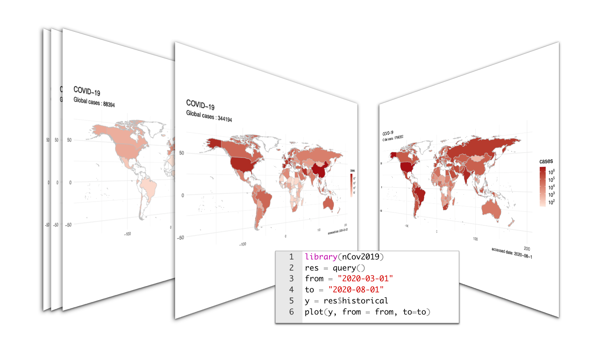
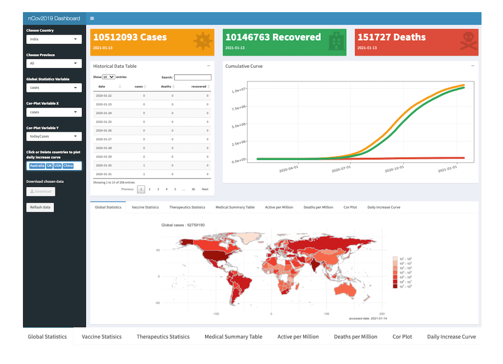

To provide convenient access to epidemiological data on the coronavirus outbreak, we developed an R package, nCov2019 (https://github.com/yulab-smu/nCov2019). Besides detailed basis statistics, it also includes information about vaccine development and therapeutics candidates. We redesigned the function plot() for geographic maps visualization and provided a  interactive shiny app. These analytics tools could be useful in informing the public and studying how this and similar viruses spread in populous countries.

## Installation

To start off, users could utilize the ‘remotes’ package to install it directly from GitHub by running the following in R:
```{r eval=FALSE}
library('remotes')
remotes::install_github("yulab-smu/nCov2019", dependencies = TRUE)
```


## Statistic query

Data query is simple as one command:
```{r 2}
library("nCov2019")
res <- query()
```

This may take seconds to few minutes, which depend on the users' network connection, if the user connection is broken, a local stored version data will be used for demo. 

The result returned by `query()` function will contains 5 types of statistic:  


```{r}
names(res)
```
- `global`    The global overall summary statistic  
- `latest`   The global latest statistic for all countries
- `historical`    The historical statistic for all countries
- `vaccine`   The current vaccine development progress
- `therapeutics`    The current therapeutics development progress

The `query()` only need to be performed once in a session, print each of statistic objects, users could get their update time. And for the `vaccine` and `therapeutics` query results, print them will return the candidates number.


### global data

The query result of global status will contain a data frame with 21 types of statistic, which have detail explanation on the bottom of this documents. And `summary(x)` will return overview of global status.

```{r}
x = res$global
x$affectedCountries # total affected countries
summary(x)
```


### latest data

Here is the example for operating latest data. once again, all data have queried and store in `res`.
```{r}
x = res$latest
```

And then `print(x)` will return the update time for the latest data
```{r}
print(x) # check update time
```

To subset latest data could be easily done by using `[`.  `x["Global"]` or x`["global"]` will return the data frame for all countries but users could determine a specific country, such as:
```{r}
head(x["Global"]) # return all global countries.
x[c("USA","India")] # return only for USA and Inida 
```

The data is order by "todayCases" column, users could sort them by other order.
```{r message=FALSE, warning=FALSE}
df = x["Global"]
head(df[order(df$cases, decreasing = T),])  
```

As for the latest data, it provides 11 types of main information by default, but 12 more statistic type are provided in the "latest\$detail", they also have corresponding explanation on the bottom. 
```{r,message=FALSE, warning=FALSE}
x = res$latest
head(x$detail)  # more detail data 
```

### historical data

Historical data is useful in retrospective analysis or to establish predictive models,  the operation is similar as  latest data, user could determine the data frame for all countries or some specific countries: 

```{r, warning=FALSE}
Z = res$historical
print(Z) # update time

head(Z["Global"])
head(Z[c("China","UK","USA")]) 
```

### vaccine and therapeutics data

Users could check for the vaccine or therapeutics developing status.  Let x be the vaccine or therapeutics query result, then `summary()` will return the summary of their trial phase, and x["all"] or x["All"] will return the summary information, such as mechanism,  trial Phase, institutions and so on. Then the detail background info will return with provided id, for example x[ID="id3"] or simple as x["id3"].  The same operation could apply to therapeutics data.
```{r, warning=FALSE}
X <- res$vaccine
summary(X)

head(X["all"])

# check for the details about the mRNA-based vaccine, id3
X[ID="id3"]
```

```{r, warning=FALSE}
X <- res$therapeutics
summary(X)
head(X["All"])
X[ID="id1"] 
```


## Visualization

We provide a visualization function as a redesign "plot".

     plot(
       x,
       region = "Global",
       continuous_scale = FALSE,
       palette = "Reds",
       date = NULL,
       from = NULL,
       to = NULL,
       title = "COVID-19",
       type = "cases",
       ...
     )

Here, type could be one of "cases","deaths","recovered","active","todayCases","todayDeaths","todayRecovered","population" and "tests". By default, color palette is "Reds", more color palettes can be found here: [palette](https://www.r-graph-gallery.com/38-rcolorbrewers-palettes.html)

To get the overview for the latest status, the mini code required is as below:
```{r fig.height=8, fig.width=12, warning=FALSE}
X <- res$latest
plot(X)
```


Or To get the overview for the detection testing status, 
```{r,fig.height=8, fig.width=12, warning=FALSE}
plot(X, type="tests",palette="Green")
```


 
It could be also intuitively compare the number of new confirmed cases per day among different countries.
```{r,fig.height=8, fig.width=12, warning=FALSE}
library(ggplot2)
library(dplyr)
X <- res$historical
X["global"] %>%
group_by(country) %>%
arrange(country,date) %>%
mutate(diff = cases - lag(cases, default =  first(cases))) -> a
tmp = subset(a, country %in% c("Australia", "Japan", "Italy", "Germany",  "China")) 

p <- ggplot(tmp,aes(date,log(diff+1),color=country)) + geom_line() +
  labs(y="Log2(daily increase cases)") + 
  theme(axis.text = element_text(angle = 15, hjust = 1)) +
  scale_x_date(date_labels = "%Y-%m-%d") + 
  theme_minimal()
p
```

 
user could also plot the outbreak map on the past time with historical data by specify a date in function plot().
```{r,fig.height=8, fig.width=12, warning=FALSE}
Y <- res$historical
plot(Y, region="Global" ,date = "2020-08-01", type="cases")
```


## Animations plot

Animated world-wide epidemic maps could be generated in the similar way. This is the example to draw a spread animation from 2020-03-01 to 2020-08-01, with little code. 

```{r eval=FALSE}
library(nCov2019)
res = query()
from = "2020-03-01"
to = "2020-08-01"
y = res$historical
plot(y, from = from, to=to)
```





## Other plots

If you wanted to visualize the cumulative summary data, an example plot could be the following:

```{r,fig.height=8, fig.width=12, warning=FALSE}
library(ggplot2)
x <- res$historical
d = x['Japan' ] # you can replace Anhui with any province
d = d[order(d$cases), ]

ggplot(d, 
       aes(date, cases)) +
  geom_col(fill = 'firebrick') + 
  theme_minimal(base_size = 14) +
  xlab(NULL) + ylab(NULL) + 
  scale_x_date(date_labels = "%Y/%m/%d") +
  labs(caption = paste("accessed date:", max(d$date)))

```

Plot  the trend for for the Top 10  increase cases countries on last day
```{r,fig.height=8, fig.width=10, warning=FALSE}
library("dplyr")
library("ggrepel")

x <- res$latest
y <- res$historical

country_list =  x["global"]$country[1:10]

y[country_list]  %>%
subset( date > as.Date("2020-10-01") ) %>%
group_by(country) %>%
arrange(country,date) %>%
mutate(increase = cases - lag(cases, default =  first(cases))) -> df

ggplot(df, aes(x=date, y=increase, color=country  ))+
  geom_smooth() + 
  geom_label_repel(aes(label = paste(country,increase)), 
    data = df[df$date == max(df$date), ], hjust = 1) + 
  labs(x=NULL,y=NULL)+ 
  theme_bw() + theme(legend.position = 'none') 
  
```

Plot the curve of cases, recovered and deaths for specify country
```{r, warning=FALSE}
library('tidyr')
library('ggrepel')
library('ggplot2')
y <- res$historical
country = "India"

y[country] -> d
d <- gather(d, curve, count, -date, -country)

ggplot(d, aes(date, count, color = curve)) + geom_point() + geom_line() + 
  labs(x=NULL,y=NULL,title=paste("Trend of cases, recovered and deaths in", country)) +
    scale_color_manual(values=c("#f39c12", "#dd4b39", "#00a65a")) +
    theme_bw() +   
  geom_label_repel(aes(label = paste(curve,count)), 
                   data = d[d$date == max(d$date), ], hjust = 1) + 
  theme(legend.position = "none",
        axis.text = element_text(angle = 15, hjust = 1)) +
  scale_x_date(date_labels = "%Y-%m-%d")
```

## heatmap for cases per country

Here is the example code for draw a heatmap for the historical data range in nCov2019.
```{r,fig.height=15, fig.width=6, warning=FALSE}
library('tidyr')
library('ggrepel')
library('ggplot2')
y <- res$historical
d <- y["global"]

d <- d[d$cases > 0,]
length(unique(d$country))
d <- subset(d,date <= as.Date("2020-3-19"))
max_time <- max(d$date)
min_time <- max_time - 7
d <-  d[d$date >= min_time,]
dd <- d[d$date == max(d$date,na.rm = TRUE),]

d$country <- factor(d$country, 
  levels=unique(dd$country[order(dd$cases)]))
breaks = c(0,1000, 10000, 100000, 10000000)

ggplot(d, aes(date, country)) + 
  geom_tile(aes(fill = cases), color = 'black') + 
  scale_fill_viridis_c(trans = 'log', breaks = breaks, 
  labels = breaks) + 
  xlab(NULL) + ylab(NULL) +
  scale_x_date(date_labels = "%Y-%m-%d") + theme_minimal()

```

Plot the global trend in a novel way.
```{r,fig.height=10, fig.width=10, warning=FALSE}

require(dplyr)

y <- res$historical
d <- y["global"]

time = as.Date("2020-03-19")
dd <- filter(d, date == time) %>% 
    arrange(desc(cases)) 

dd = dd[1:40, ]
dd$country = factor(dd$country, levels=dd$country)

dd$angle = 1:40 * 360/40
require(ggplot2)
p <- ggplot(dd, aes(country, cases, fill=cases)) + 
    geom_col(width=1, color='grey90') + 
    geom_col(aes(y=I(5)), width=1, fill='grey90', alpha = .2) +       
    geom_col(aes(y=I(3)), width=1, fill='grey90', alpha = .2) +    
    geom_col(aes(y=I(2)), width=1, fill = "white") +
    scale_y_log10() + 
    scale_fill_gradientn(colors=c("darkgreen", "green", "orange", "firebrick","red"), trans="log") + 
    geom_text(aes(label=paste(country, cases, sep="\n"), 
                  y = cases *.8, angle=angle), 
            data=function(d) d[d$cases > 700,], 
            size=3, color = "white", fontface="bold", vjust=1)  + 
     geom_text(aes(label=paste0(cases, " cases ", country), 
                  y = max(cases) * 2, angle=angle+90), 
            data=function(d) d[d$cases < 700,], 
            size=3, vjust=0) + 
    coord_polar(direction=-1) + 
    theme_void() + 
    theme(legend.position="none") +
    ggtitle("COVID19 global trend", time)
p
```


Number of days since 1 million cases per country 
```{r,fig.height=8, fig.width=12, warning=FALSE}
require(dplyr)
require(ggplot2)
require(shadowtext)
 

y <- res$historical
d <- y["global"]


dd <- d %>% 
  as_tibble %>%
  filter(cases > 1000000) %>%
  group_by(country) %>%
  mutate(days_since_1m = as.numeric(date - min(date))) %>%
  ungroup 
  

  

breaks=c(1000, 10000, 20000, 50000, 500000,500000,5000000,20000000)


p <- ggplot(dd, aes(days_since_1m, cases, color = country)) +
  geom_smooth(method='lm', aes(group=1),
              data = dd, 
              color='grey10', linetype='dashed') +
  geom_line(size = 0.8) +
  geom_point(pch = 21, size = 1) +
  scale_y_log10(expand = expansion(add = c(0,0.1)), 
                breaks = breaks, labels = breaks) +
  scale_x_continuous(expand = expansion(add = c(0,1))) +
  theme_minimal(base_size = 14) +
  theme(
    panel.grid.minor = element_blank(),
    legend.position = "none",
    plot.margin = margin(3,15,3,3,"mm")
  ) +
  coord_cartesian(clip = "off") +
  geom_shadowtext(aes(label = paste0(" ",country)), hjust=0, vjust = 0, 
                  data = . %>% group_by(country) %>% top_n(1,days_since_1m),
                  bg.color = "white") +
  labs(x = "Number of days since 1,000,000th case", y = "", 
       subtitle = "Total number of cases")
print(p)

```


## dashboard

dashboard could launch as below:
```{r eval=FALSE}
dashboard()
```



## statistic item explanation

| statistic              | explain                                                |
| ---------------------- | ------------------------------------------------------ |
| active                 | active number = comfirmed cases -  deaths - recoveredd |
| activePerOneMillion    | active number / million population                     |
| cases                  | comfirmed cases                                        |
| casesPerOneMillion     | comfirmed cases / million   population                 |
| continent              | continent                                              |
| country                | country                                                |
| critical               | Critical patients                                      |
| criticalPerOneMillion  | Critical patients / million population                 |
| date                   | date                                                   |
| deaths                 | deaths                                                 |
| deathsPerOneMillion    | deaths patients / million population                 |
| oneCasePerPeople       | oneCasePerPeople                                       |
| oneDeathPerPeople      | oneDeathPerPeople                                      |
| oneTestPerPeople       | oneTestPerPeople                                       |
| population             | population                                             |
| recovered              | recovered                                              |
| recoveredPerOneMillion | recoveredPerOneMillion                                 |
| tests                  | COVID-19 test                                          |
| testsPerOneMillion     | COVID-19 test / million population                     |
| todayCases             | comfirm cases in today                                 |
| todayDeaths            | comfirm cases in today                                 |
| todayRecovered         | comfirm cases in today                                 |
| updated                | the latest update time                                 |


## Session Info 
```{r}
sessionInfo()
```
